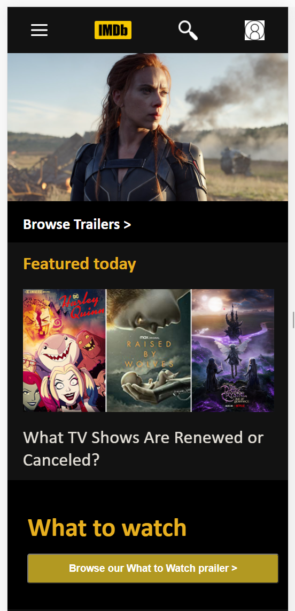
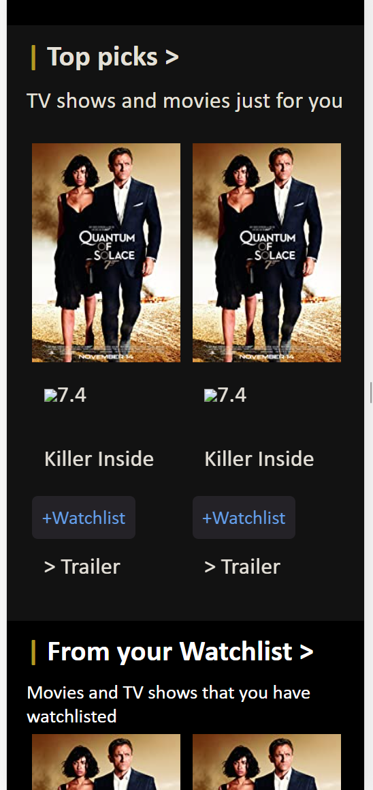
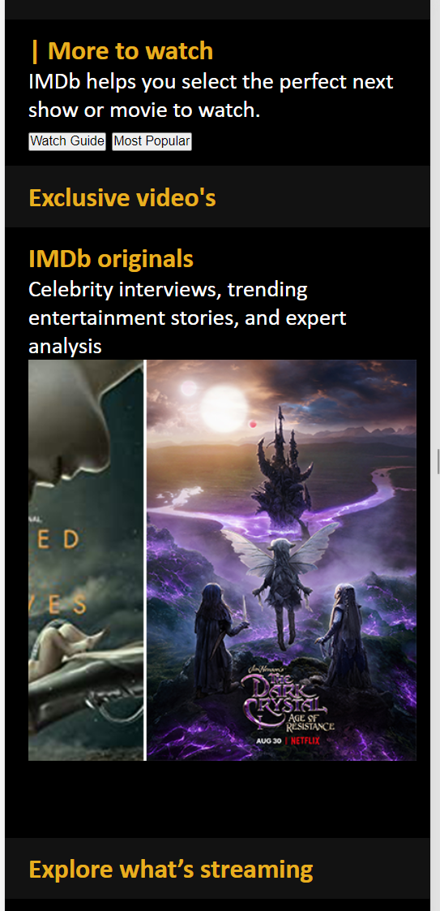
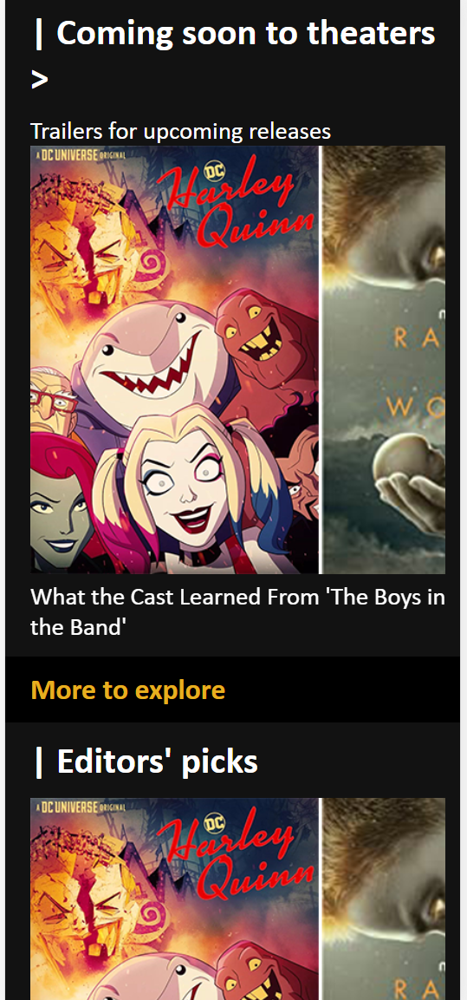
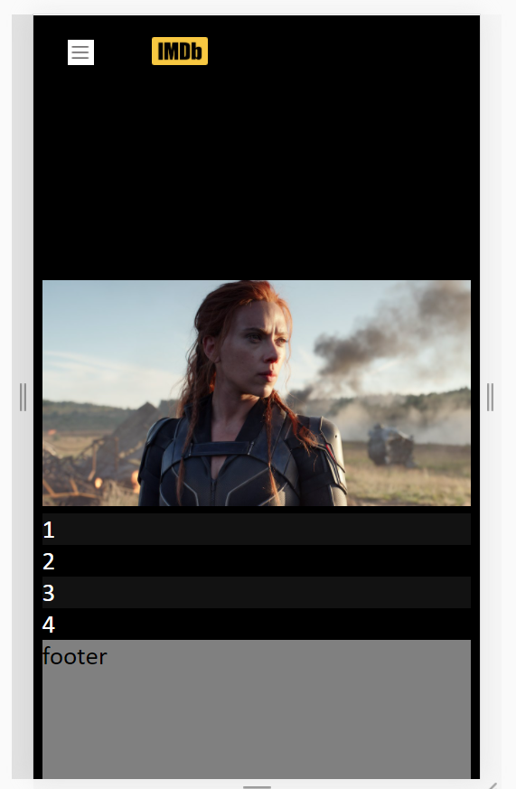
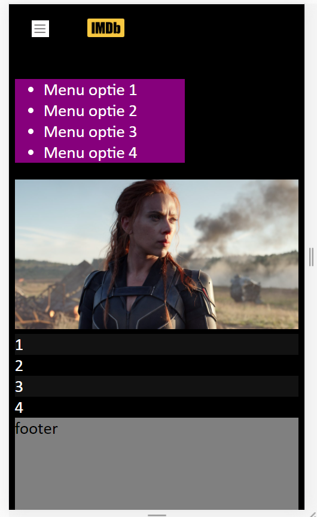
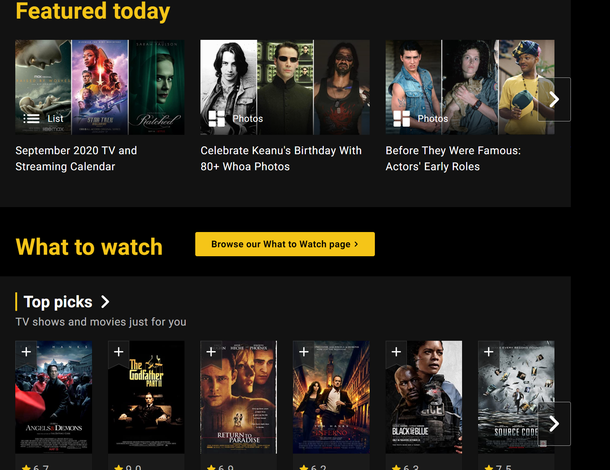
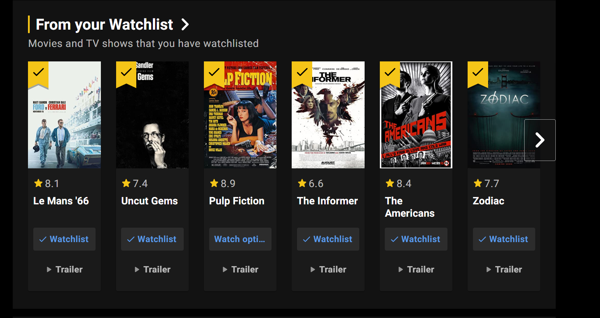
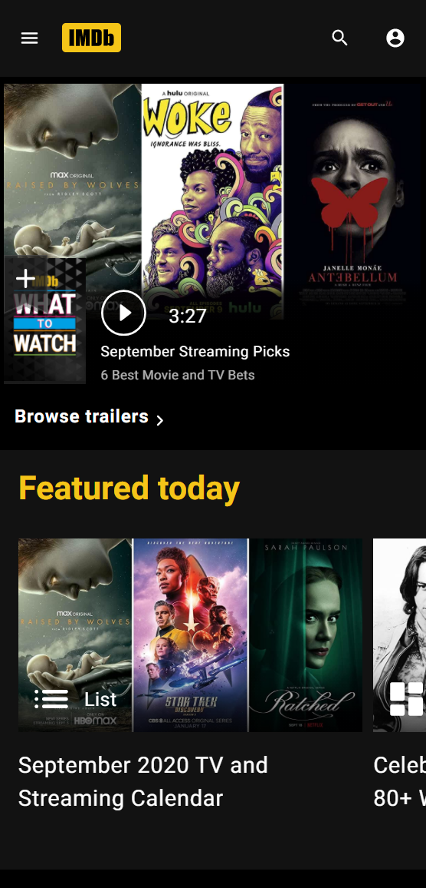
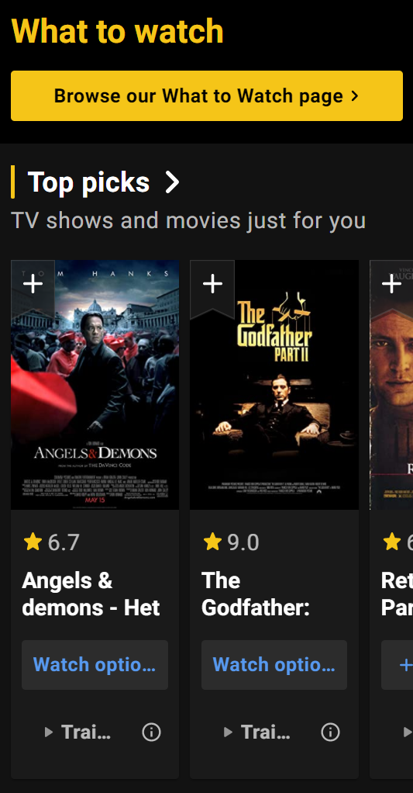

# Procesverslag
**Auteur:** -jouw naam-

Markdown cheat cheet: [Hulp bij het schrijven van Markdown](https://github.com/adam-p/markdown-here/wiki/Markdown-Cheatsheet). Nb. de standaardstructuur en de spartaanse opmaak zijn helemaal prima. Het gaat om de inhoud van je procesverslag. Besteedt de tijd voor pracht en praal aan je website.

## Bronnenlijst
1. -bron 1-
2. -bron 2-
3. -...-

## Eindgesprek (week 7/8)

-dit ging goed & dit was lastig-

**Screenshot(s):**

-screenshot(s) van je eindresultaat-

## Voortgang 3 (week 6)

### Stand van zaken

-dit ging goed & dit was lastig-

**Screenshot(s):**

-screenshot(s) van hoe ver je bent-

### Agenda voor meeting

-samen met je groepje opstellen-

### Verslag van meeting

-na afloop snel uitkomsten vastleggen-

## Voortgang 2 (week 5)

### Stand van zaken

De homepagina van IMDB is erg lang en er zit veel informatie en afbeeldingen in. 
Wat steeds terugkomt zijn de sliders. Boven de afbeeldingen van de sliders staan er op
de IMDb website ook nog buttons om het aan "jouw lijst" toe te voegen.

Misschien is het een leuk idee om met de surface plane een button aan te maken in het menu
waarin ik films en series kan toevoegen en hierdoor het nummertje bij het icoontje omhoog gaat
zoals bijvoorbeeld in een winkelmandje bij bol.com. Dit is wel een leuk idee om te leren en naar 
toe te streven.

-dit ging goed & dit was lastig-

Wat goed ging:
• Heb het idee dat het HTML & CSS lukt en de site er goed uit ziet
• Begint steeds meer op de originele site te lijken
• Nieuwe dingen uitgevonden zoals de css slider
• Hier en daar nieuwe efficiente CSS geleerd zoals de nth-of-type(even) 

Wat lastig was:
• Het HTML en CSS geordend houden
• Niet het overzicht verliezen van de codes en het gestructureerd houden
• De slider perfect maken zoals die op IMDB staat en responsive
• Waarschijnlijk gaat komende weken het responsive maken lastig worden

**Screenshot(s):**
Dit zijn screenshots van hoe ver ik 02-10-2020 ben met de IMDb website. 

### Agenda voor meeting

Met het groepje bespreken wie wat gaat vragen en in welke volgorde.

Op dit moment niet veel vragen, doordat het meeste van de pagina gedaan is
moet alleen alles veel netter maken en wellicht html en css overzichtelijker maken.
Het gaat nu meer om de styling op dit moment wat tot nu toe goed gaat.

Volgende week verwacht ik meer moeite te krijgen d.m.v. het responsive maken van de website.

### Verslag van meeting

• Goed om te zien hoe ver iedereen is
• Inspiratie uit de gesprekken hoe klasgenoten problemen oplossen
• Wellicht kijken hoe ik een slider met een grid kan maken
• Vraag klasgenoten om hulp die jouw probleem al hebben opgelost als het niet lukt
• Kris berichten sturen via teams als ik ergens niet uit kom of feedback wil.

## Voortgang 1 (week 3)

### Stand van zaken

-dit ging goed & dit was lastig-

Basis opgezet van de site. Erg veel bezig geweest met het menu en zitten stoeien met het javascript. Veel verschillende opties geprobeerd.
Uiteindelijk met een remove optie de menu class proberen weg te halen, en dan weer op te roepen als er op de hamburger geklikt wordt.
Ik heb hier feedback om gevraagt.

**Screenshot(s):**

Dit is hoe ver ik momenteel ben gekomen met het menu. Het heeft een toggle functie alleen komt het nu onder het menu
inplaats van daarboven. Ik moet even kijken hoe ik dit kan oplossen. Ben in ieder geval blij dat het gelukt is met de toggle functie.

### Agenda voor meeting

-samen met je groepje opstellen-

Vragen stellen over menu en vragen over wat efficient is qua html en css. 
Vragen over de eindopdracht in hoeverre dingen moeten.

### Verslag van meeting

-na afloop snel uitkomsten vastleggen-

Bespreking met Kris tips:
•	Gebruik een toggle optie voor het menu inplaats van een remove en add optie.
•	Blijf niet te lang vast zitten bij het javascript gedeelte en ga door.
•	Probeer eerst het gene te doen waar je goed in bent, zodat dat alvast gedaan is.
•	Begin alvast met de styling van de website, ga daarna verder met de moeilijkere dingen
waar je minder bekend mee bent.

## Intake (week 1)

**Je startniveau:** -kies uit zwart, rood óf blauw-
Mijn start niveau is de rode piste. 

**Je focus:** -kies uit responsive óf surface plane-
Mijn focus gaat uit naar responsive. Ik ben wel van plan om zeker ook aan de surface plan te gaan werken als hier
genoeg tijd voor is. Ik vind beide namelijk erg interessant en denk dat ik de toekomst aan beide veel heb.

**Je opdracht:** -link naar de website die je gaat namaken óf de naam van je eigen ontwerp-
www.imdb.com

**Screenshot(s):**

Screenshots van de desktop versie van IMDB:

!(images/voortgang/Screenshot1.png)

Screenshots van de mobiele versie van IMDB:

**Breakdown-schets(en):**

