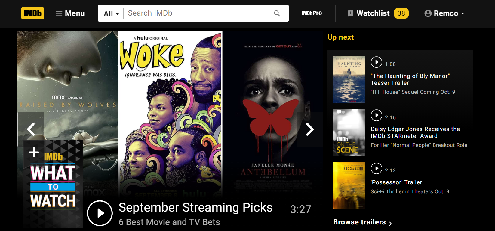
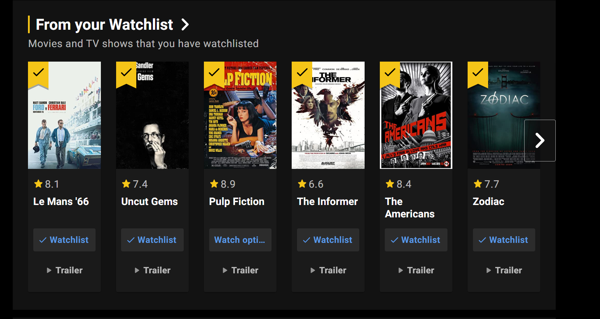
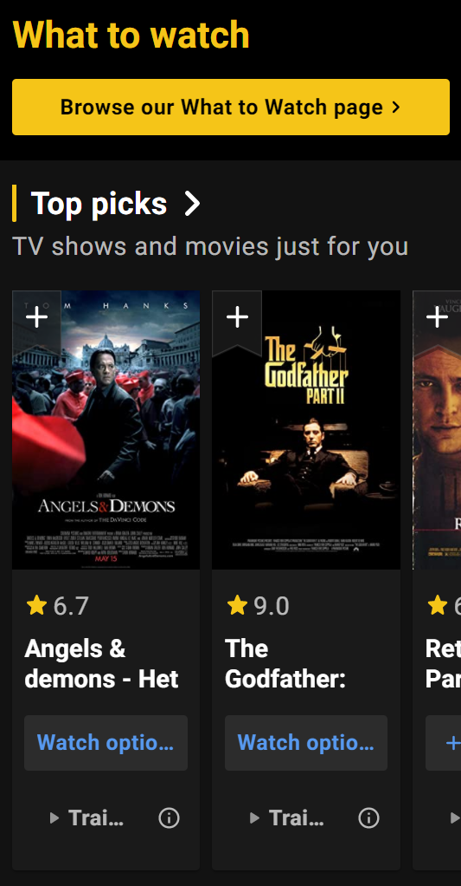
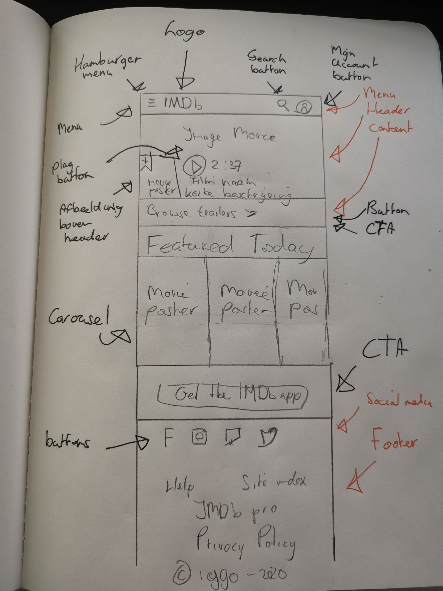

# Procesverslag
**Auteur:** -jouw naam-

https://123rvb123.github.io/FED/.

Markdown cheat cheet: [Hulp bij het schrijven van Markdown](https://github.com/adam-p/markdown-here/wiki/Markdown-Cheatsheet). Nb. de standaardstructuur en de spartaanse opmaak zijn helemaal prima. Het gaat om de inhoud van je procesverslag. Besteedt de tijd voor pracht en praal aan je website.

## Bronnenlijst
1. -bron 1-
2. -bron 2-
3. -...-

## Eindgesprek (week 7/8)

-dit ging goed & dit was lastig-

**Screenshot(s):**

-screenshot(s) van je eindresultaat-

## Voortgang 3 (week 6)

-same as voortgang 1-

## Voortgang 2 (week 5)

-same as voortgang 1-

## Voortgang 1 (week 3)

### Stand van zaken

-dit ging goed & dit was lastig-
Javascript was lastig. Veel dingen geprobeerd uiteindelijk wel steeds dichter bij uiteindelijke doel gekomen, het menu in en uitklappen.

**Screenshot(s):**

-screenshot(s) van hoe ver je bent-

### Agenda voor meeting

-samen met je groepje opstellen-
Vragen stellen menu. Vragen stellen javascript. Vragen stellen semantische code. Vragen stellen optimale manier om te werken.

### Verslag van meeting

-na afloop snel uitkomsten vastleggen-

Meeting ging goed, kreeg goede feedback van Kris.
 
Advies van Kris:

• Begin met de CSS en niet met javascript (zodat je niet erg lang vastloopt)
• Begin met het ''makkelijke'' eerst (in mijn geval html&css) dan heb je in ieder geval al iets staan
• Probeer zoveel mogelijk werk te doen (waar je vast loopt later uitwerken)

Punt voor nu
• Probeer met Javascript niet het hele element weg te halen, maar met css het te verbergen d.m.v. toggle optie.

## Intake (week 1)

**Je startniveau:** Rode piste

**Je focus:** responsive

**Je opdracht:** https://m.imdb.com/

**Screenshot(s):**

**Mobiel formaat:**

**Breakdown-schets(en):**

